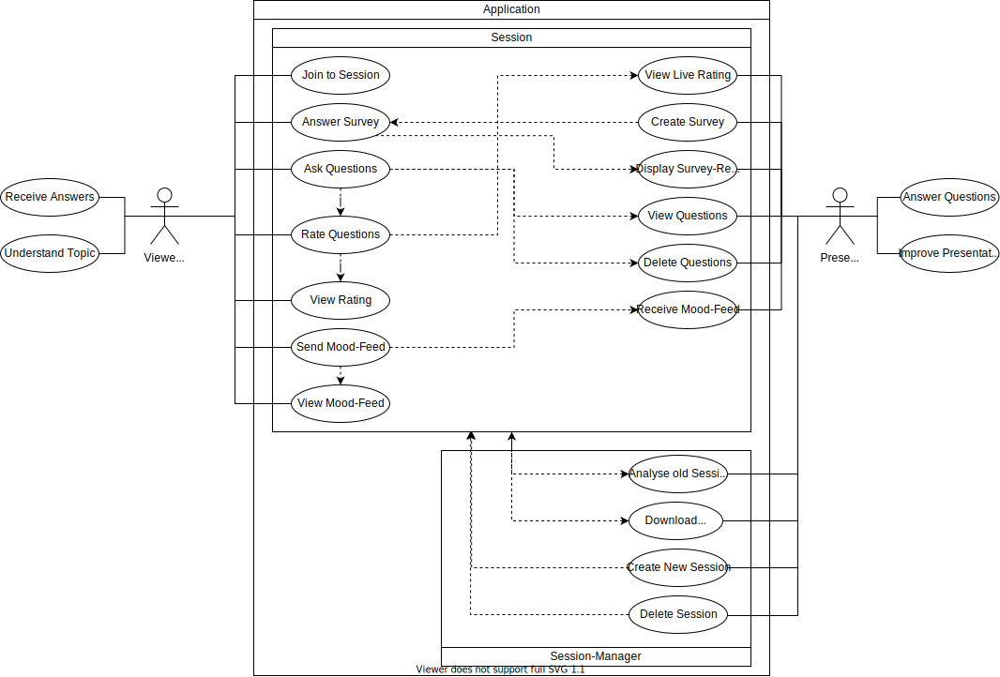

# LectureFeed - Software Requirements Specification 

## Table of contents
- [Table of contents](#table-of-contents)
- [Introduction](#1-introduction)
    - [Purpose](#11-purpose)
    - [Scope](#12-scope)
    - [Definitions, Acronyms and Abbreviations](#13-definitions-acronyms-and-abbreviations)
    - [References](#14-references)
    - [Overview](#15-overview)
- [Overall Description](#2-overall-description)
    - [Vision](#21-vision)
    - [Use Case Diagram](#22-use-case-diagram)
	- [Technology Stack](#23-technology-stack)
- [Specific Requirements](#3-specific-requirements)
    - [Functionality](#31-functionality)
    - [Usability](#32-usability)
    - [Reliability](#33-reliability)
    - [Performance](#34-performance)
    - [Supportability](#35-supportability)
    - [Design Constraints](#36-design-constraints)
    - [Online User Documentation and Help System Requirements](#37-on-line-user-documentation-and-help-system-requirements)
    - [Purchased Components](#purchased-components)
    - [Interfaces](#39-interfaces)
    - [Licensing Requirements](#310-licensing-requirements)
    - [Legal, Copyright And Other Notices](#311-legal-copyright-and-other-notices)
    - [Applicable Standards](#312-applicable-standards)
- [Supporting Information](#4-supporting-information)

## 1. Introduction

### 1.1 Purpose
This Software Requirements Specification (SRS) describes all specifications for the application "LectureFeed". It includes an overview about this project and its vision, detailed information about the planned features and boundary conditions of the development process.

### 1.2 Scope
The project is going to be realized as an Web-Application.  
  
Actors of this App can be viewers or presenters.
  
Planned Subsystems are: 
* Session-Manager 
  Here presenters can analyse data from previous sessions to improve their presentation skills and create new presentation-sessions for their listeners to join.
* Session
A session consists of two views. A viewer GUI, where the viewers can ask questions, vote questions, participate in polls and give real time feedback and an administrative GUI for the presenter to manage polls, see upvoted questions and receive mood feedback of the audience.

### 1.3 Definitions, Acronyms and Abbreviations
| Abbrevation | Explanation                            |
| ----------- | -------------------------------------- |
| [SRS]         | Software Requirements Specification    |
| [UC]          | Use Case                               |
| [n/a]         | not applicable                         |
| [tbd]         | to be determined                       |
| [UCD]         | overall Use Case Diagram               |
| [FAQ]         | Frequently asked Questions             |
| [GUI]         | Graphical User Interface               |
| [UI]          | User Interface                         |

### 1.4 References

| Title                                                              | Date       | Publishing organization   |
| -------------------------------------------------------------------|:----------:| ------------------------- |
| [LectureFeed Blog](http://lecturefeed.wordpress.com)    	     | 21.10.2021 | LectureFeed Team    |
| [GitHub](https://github.com/MaximilianLincks/LectureFeed)          | 21.10.2021 | LectureFeed Team    |

### 1.5 Overview
The following chapter provides an overview of this project with vision and Overall Use Case Diagram. The third chapter (Requirements Specification) delivers more details about the specific requirements in terms of functionality, usability and design parameters. Finally there is a chapter with supporting information. 
    
## 2. Overall Description

### 2.1 Vision
After transitioning from online-lectures into learning in presence we found out that there are many functionalities provided by online learning-environments which we missed sitting inside DHBW Karlsruhe.  
Furthermore we collectively decided to improve the way to give and get Feedback during presentations. Asking questions anonymously helps students like us to voice feedback and questions without interrupting the presentation.  
Implementing a System to vote questions can help the presenter to prioritize the important questions evaluating the number of users interested.

### 2.2 Use Case Diagram

### 2.3 Technology Stack
The technology we use is:

Backend:
- Maven and Springboot
- NoSQL Database

Frontend:
- Angular
- TypeScript
- HTML
- SCSS

IDE:
- IntelliJ

Project Management:
- YouTrack
- GitHub
- Discord

Deployment:
- Sonarcloud
- tbd

Testing:
- tbd

## 3. Specific Requirements

### 3.1 Functionality
This section will explain the different use cases, you could see in the Use Case Diagram, and their functionality.  
- 3.1.1 Creating a session
- 3.1.2 Moderating a session
- 3.1.3 Join a session
- 3.1.4 Participate in a session

#### [3.1.1 Creating a session](./use-cases/create-a-session.md)
For each presentation the presenter should create a new session so he later can get distiguishable feedback. This helps to analyse and overview the last presentations.

#### [3.1.2 Moderating a session](./use-cases/moderate-a-session.md)
Using state of the art technologies the presenter can get realtime feedback from the audience and is shown the most upvoted questions. Questions can be marked as answerd or closed. This helps to interact with the audience, to enhance the experience and improve the understanding of the viewers.

#### [3.1.3 Join a session](./use-cases/join-a-session.md)
Viewers have to join the session to participate using a nick name.

#### [3.1.4 Participate in a session](./use-cases/participate-in-session.md)
This essentail feature enables the viewers to interact with the presenter through the application. They can ask questions using a nickname or anonymous and give realtime feedback of their mood. This way the presenter can change his style to adapt to communication problems or increase the presenting speed. 

### 3.2 Usability
Using state of the art technologies we want to provide a simple and intuitive interface for both presenter and viewer. With a comfortable UI we strife for a quick introduction to the application.  

#### 3.2.1 Minimal Setup needed
With a minimalistic structure the application is setup quickly and can be used immediately.

#### 3.2.2 easy acces
There will be almost no entry barriers because users just have to open the link to the current presentation session in their browsers. This enables users from all platforms to join the session.

### 3.3 Reliability

#### 3.3.1 Availability
The presenter can host the application as needed using any device with an installed Java-Runtime-Environment due to the server beeing embedded. Furhtermore its possible to host this application as a public servers or servers on an intranet.

#### 3.3.2 Defect Rate
To prevent package loss we are using new technologies like ServiceWorker. This way we can buffer data and resend it while reconnecting with the server.

### 3.4 Perfomance

#### 3.4.1 Capacity
We plan to reduce the data transfer to a minimum to get the maximum performance.
The system should be able to connect with 50 or more people depending on the hosting device. The 

#### 3.4.3 App perfomance / Response time
The application is loaded on runtime. Data backups are created regularly. The overall response time is keept as low as possible for the best user experience. To achieve this we plan on using a socket connection.

### 3.5 Supportability

#### 3.5.1 Coding Standards
We will use the language specific conventions to keep the code as clean and readable. We will also use telling names on classes, functions, variables etc. Codereviews will ensure a high quality and fewer errors. Functions and classes will be keept as small and modular as possible.

#### 3.5.2 Testing Strategy
tbd
For code checkup we are using Sonarcloud.

### 3.6 Design Constraints
We are trying to provide a modern and easy to handle design for the UI aswell as for the architecture of our application. To achieve that the functionalities will be kept as modular as possible.

Because we are progamming an Web-Application we chose Java and Angualr as our programming languages. Also we are using the common and Angular native MVC-architecture to keep the front end and back end seperated.

To make the communication between the two parts easy, we will implement a RESTful-API and Websockets. The data will be transfered in the JSON-format which is already implemented in Angular and JavaSpring.
The supported Platforms will be:
- Java 17 and higher
- Angular 1.8.*

### 3.7 Online User Documentation and Help System Requirements
We will provide the GitHub Link to the project so users can ask for help, bug reports and future requests.
As already mentioned earlier it will be possibel to host this application on a server. We will provide documentation on the setup on a raspberry-pi.
### 3.8 Purchased Components
We don't have any purchased components yet. Maybe we will buy a rasberry-pi.

### 3.9 Interfaces

#### 3.9.1 User Interfaces
tbd
#### 3.9.2 Hardware Interfaces
(n/a)

#### 3.9.3 Software Interfaces
- Java 17 and higher
- Angular 1.8.*

#### 3.9.4 Communication Interfaces
The server and hardware will communicate using the http and socket protocol. 

### 3.10 Licensing Requirements

### 3.11 Legal, Copyright, and Other Notices
The logo is licensed to the LectureFeed Team and is only allowed to use for the application. We do not take responsibilty for any incorrect data or errors in the application. The application is published under the Apache License 2.0.

### 3.12 Applicable Standards
tbd

## 4. Supporting Information
For any further information you can contact the LectureFeed Team or check our [LectureFeed Blog](http://lecturefeed.wordpress.com). 
The Team Members are:
- Lukas Hörnle
- Stefanie Neuman
- Viktor Aigenseer
- Maximilian Lincks

