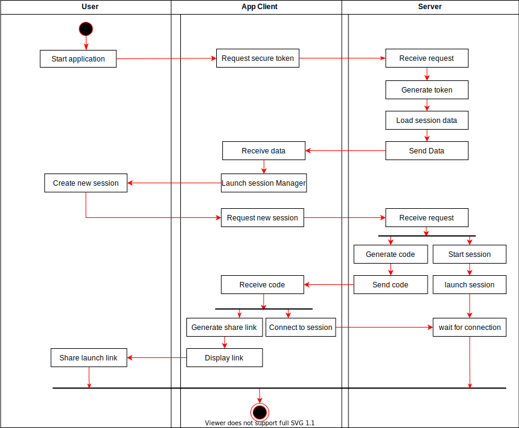

#Use-Case Specification: Creating a Session

# 1 Creating a Session

## 1.1 Brief Description
The Moderator has to create a session to use the LectureFeed Application to interact with his audience.

# 2 Flow of Events
## 2.1 Basic Flow
- Moderator starts LectureFeed application
- Moderator opens the LectureFeed Moderator-page
- Create new Session
- Server: generate invite-link, session-code (maybe QR-Code)
- Share Invite Link

### 2.1.1 Activity Diagram


### 2.1.2 Mock-up


### 2.1.3 Narrative

```gherkin
Feature: create session

  Scenario: create a session 
    Given I started the LectureFeed application
    And I opened a browser on a different device 
    When I open the moderator-page
    And I enter a valid Admin-token
    And I press the “create session” button    
    Then create a new session invite-link, session-code, QR-Code
```

## 2.2 Alternative Flows
If a bad admin-token is provided an error message is shown

# 3 Special Requirements
(n/a)

# 4 Preconditions
(n/a)

# 5 Postconditions
After the creation of a new session, a valid session exists.

# 6 Extension Points
(n/a)

