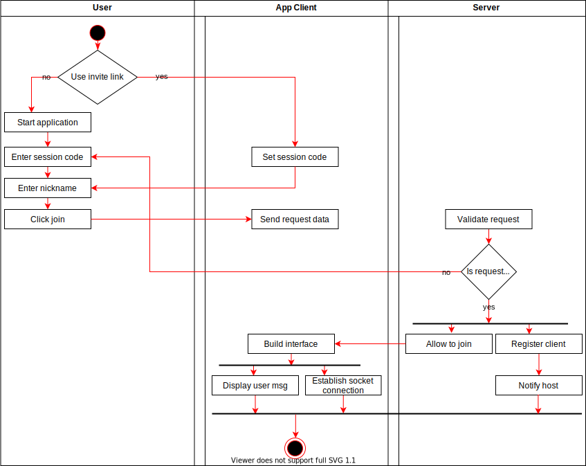
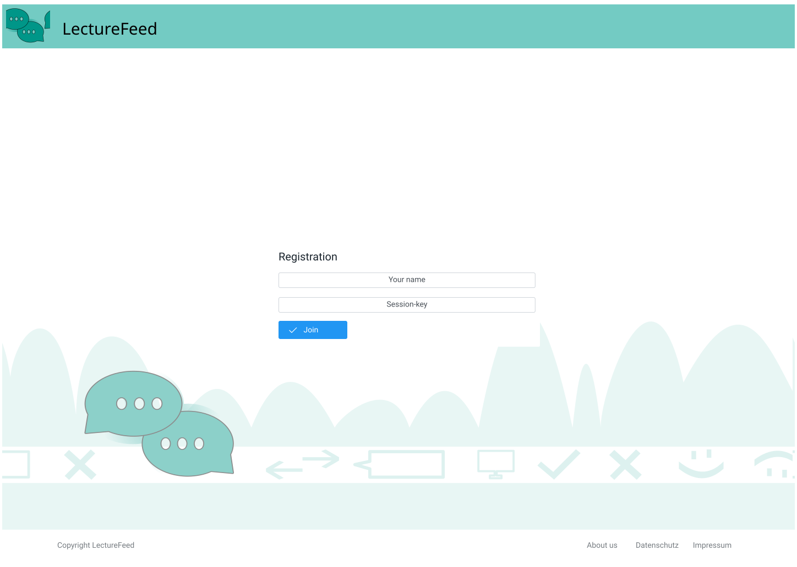

#Use-Case Specification: Joining a Session

# 1 Joining a Session

## 1.1 Brief Description
Every Viewer should be able to join an existing session by clicking on an invite-link or by entering the session-code. Viewers have to enter a nickname to join.

# 2 Flow of Events
## 2.1 Basic Flow
- Viewer clicks on the invite link or opens the homepage and enters the session code.
- Viewer enters his nickname
- Viewer clicks on the “join session” button

### 2.1.1 Activity Diagram

### 2.1.2 Mock-up

### 2.1.3 Narrative

## 2.2 Alternative Flows
(n/a)

# 3 Special Requirements
(n/a)

# 4 Preconditions
## 4.1 Presenter has already created the session and gave out the session-code/ invite-link.

# 5 Postconditions

# 6 Extension Points
(n/a)

