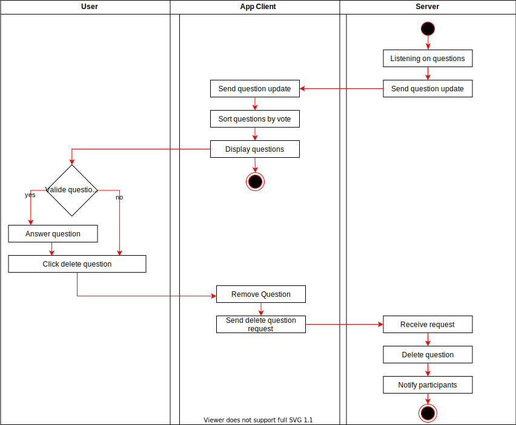

#Use-Case Specification: Moderate a session

# 1 Moderate a session

## 1.1 Brief Description
The Moderator can moderate and monitor the questions and the mood-Feedback from the viewers.

# 2 Flow of Events
## 2.1 Basic Flow
- Answers questions and marks them as closed
- removes stupid/ inapropriate questions

### 2.1.1 Activity Diagram


### 2.1.2 Mock-up
The Mock-up for moderating a session is simlar to the Mock-up for participating in a session (the picutres below).


### 2.1.3 Narrative

```gherkin
Feature: 
```

## 2.2 Alternative Flows
(n/a)

# 3 Special Requirements
(n/a)

# 4 Preconditions
## 4.1 The moderator has created a session. Viewers have joined the session. They are asking questions and up-/ down-vote questions.

# 5 Postconditions
(n/a)

# 6 Extension Points
(n/a)


