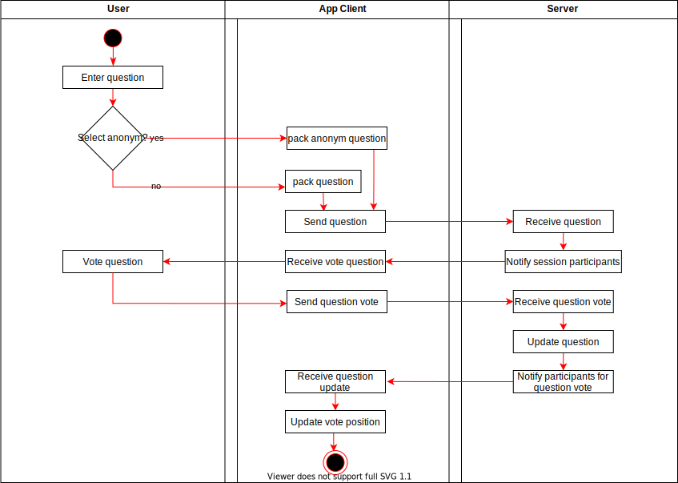
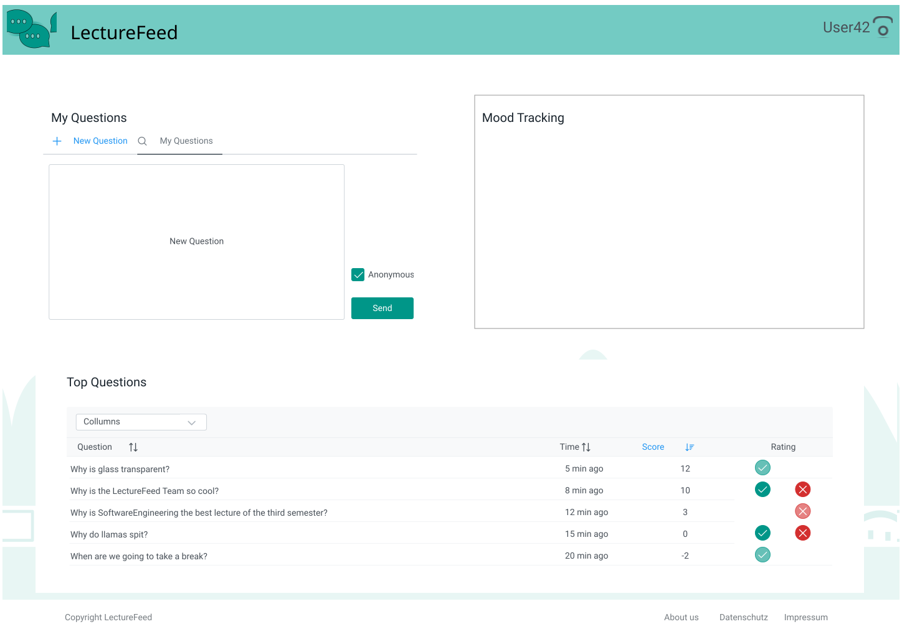
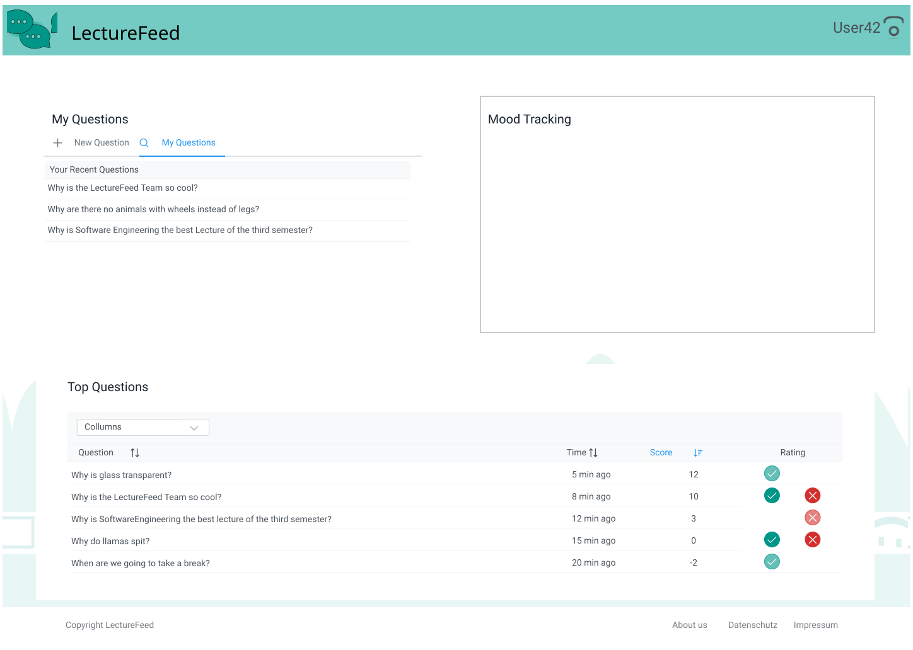

#Use-Case Specification: Participate in a session

# 1 Participate in a session

## 1.1 Brief Description
The Viewer can interact with the moderator and the questions from other viewers if he joined the session.

# 2 Flow of Events
## 2.1 Basic Flow
- enters question with his nickname / anonym
- up-/down-vote other questions

### 2.1.1 Activity Diagram


### 2.1.2 Mock-up



### 2.1.3 Narrative

```gherkin
Feature: 
```

## 2.2 Alternative Flows
(n/a)

# 3 Special Requirements
(n/a)

# 4 Preconditions
## 4.1 The Viewer has already joined the session with a nickname

# 5 Postconditions
(n/a)

# 6 Extension Points
(n/a)

